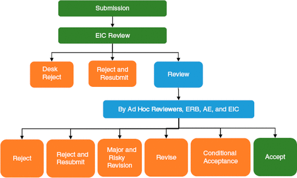
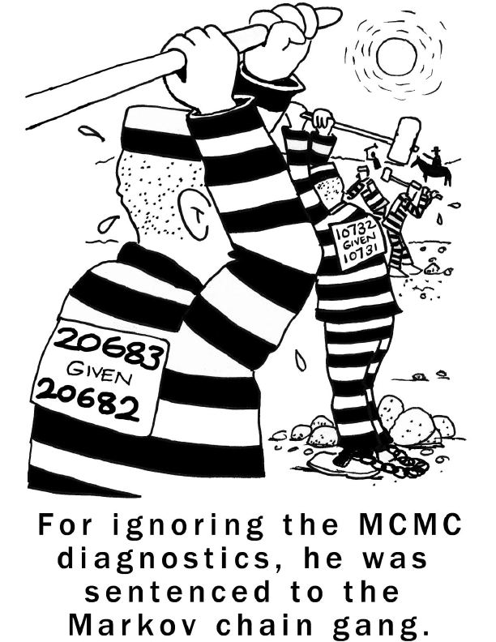
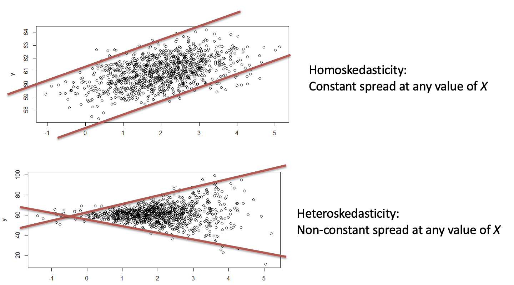
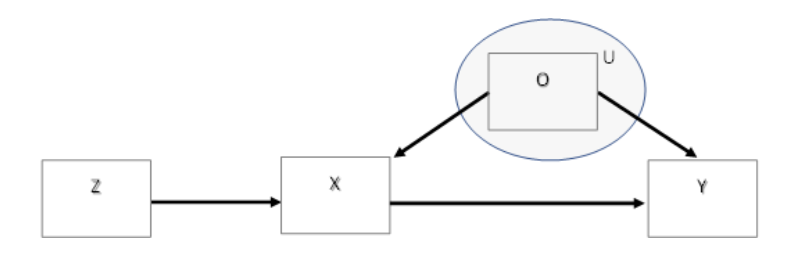

```{r setup, include = FALSE}
# loading libraries
library(tidyverse)
library(palmerpenguins)
library(fontawesome)

# preset code chunk options
knitr::opts_chunk$set(dpi = 300,            # ensures high resolution images
                      echo = FALSE,         # FALSE: code chunks don't show
                      warning = FALSE,      # FALSE: suppresses warning messages
                      error = FALSE)        # FALSE: Suppresses error messages
```

class: title-slide, center, middle, inverse
background-image: url(img/businessman.jpg)
background-position: bottom
background-size: cover

# `r rmarkdown::metadata$title`

Ahmad Daryanto

Lancaster University

Presented at the Department of Statistics

University of Diponegoro, Indonesia

11 October 2021

---
## Types of research articles

* Conceptual: theory, methodology (a review)

* Review: narrative (qual), meta-analysis

* Empirical (original research): survey, experiment, econometric modelling

* Methodological (but not a review): methodological procedures, codes


```{r message=FALSE, warning=FALSE, fig.align='right' ,out.height="40%", out.width="40%", fig.cap="Art: Hilda Bastian"}

```

---
## Be Mindful

Different journals are strongly associated with different types of articles.

* Marketing Science --> Econometric modelling with metrics data not survey

* Journal of Consumer Psychology ---> Experiment

* Journal of Business Research accommodates nearly types of articles

```{r message=FALSE, warning=FALSE, fig.align='center' ,out.height="60%", out.width="60%", fig.cap="Art: Henck van Bilsen"}

```
---
## What is contribution?

### **Discover** new knowledge

  * Conceptualization and measurement of Market orientation (Kohli and Jaworski, 1990)
  * Common-method bias in a survey research (see McKenzie and Podsakof, 2012)
  
### Extend existing knowledge

  ** Extending the meaning of a construct, e.g., multidimensional constructs
  
  ** Discovering boundary conditions, e.g., X --> Y depends on another variable.
  
  ** Explaining a process, e.g., X --> M --> Y
  
  ** Improving past results, e.g., X --> Y suffers from Endogeneity problems (and you find an instrument).
  
### **A**pplying knowledge into a new setting
  * Why new settings?

```{r, out.width = "200px", echo=FALSE, fig.align='right', include=TRUE}
knitr::include_graphics("https://absolutelymaybe.plos.org/wp-content/uploads/sites/8/2020/05/Eureka.jpg")
```


---

## Are we making contributions?
* Academic
* Managerial/practical/policy



source: Kumar(2016)


---
class: reverse, middle, center

## Why contributions?

Your turn... 

---

## Tips

### Learning

Attempt to: 
 * replicate previous studies
   + re-derived mathematical formulations
   + replicate past simulations
   + https://osf.io (good resources for original data and codes of published papers)
 * read seminal papers (first-hand exposure)

### Engagement
 * Stay on the same topic
 * Build research vocabularies
 * Follow the conversation
 * Try to publish
 * Leave your footprint: move to another domain after publising 2-3 articles
 * Thinking of comeback
 
---
class: reverse
## Tips..
### Writing a paper
 * Articulate research contribution(s)
   e.g, We contribute to literature by demonstrating that Markov chain can not be used to lock burglars.
   
```{r message=FALSE, warning=FALSE, fig.align='center' ,out.height="50%", out.width="30%"}

```
* Choose `good` journal
  + [Academic Journal Guide (AJG) list](https://www.researchgate.net/publication/352767191_Academic_Journal_Guide_2021_It_was_earlier_ABS_2021_Ranking_list)
  + Open source for impact e.g., [TQMP](https://www.tqmp.org)
* Good documentation
  + Source codes
---
class: reverse

## Illustrations

A. Moderated multiple regression (MMR) model
\begin{equation}
Y = \beta_0 + \beta_1 X + \beta_2 Z + \beta XZ + \varepsilon, \varepsilon \sim N(0,1)
\end{equation}

Contribution: Information-based theory technique in avoiding *spurious moderation*

spurious moderation: e.g, If X --> Y is nonlinear in a population, estimating parameters of the MMR above will produce a significant $\beta_3$.

```{r message=FALSE, warning=FALSE, fig.align='center' ,out.height="70%", out.width="70%"}

```
---
# Spurious - demo
Putting our demo into a [context](https://www.sciencedirect.com/science/article/abs/pii/S0148296319304606)

X = Place attachment; Z = Trust toward government program; Y = Pro-environmental behaviour

see: Song, Zening, Ahmad Daryanto and Didier Soopramanien. (2019). Place Attachment, Trust and Mobility:  Three-way Interaction Effect on Urban Residents' Environmental Citizenship Behaviour. Journal of Business Research, 105, 168-177.

```{r, echo= TRUE, warning=FALSE, message=FALSE}
# Data generation
set.seed(5)      # set a random seed
library(MASS)    # to use mvrnorm function
nobs <- 1000

rxz = 0.1         # set correlation between x and z
mu=c(0,0)         # set means for x and z
sigma=matrix(c(1, rxz, rxz,1), 2, 2) # set covariance matrix

population_data=mvrnorm(nobs,mu,sigma) # population data
x = population_data[,1]     # extract x
z = population_data[,2]     # extract z

e <- rnorm(nobs, 0, 1)  # generate error term
y <- x + x**2 + e       # generate y, nonlinearly related to x

```
---

## Spurious - demo

### Apply MMR model

Now, using the generated data, let us apply the moderated regression model:

```{r, echo= TRUE, warning=FALSE, message=FALSE}

# Applying MMR model

 fit <- lm(y ~ x + z + x:z)
 summary(fit)

```

---
## Illustrations...

B. Heteroskedasticity problem in multiple linear regression

[Click this to see the paper](https://www.tqmp.org/Vignettes/vol16-5/v008/v008.pdf)


  Homoskedasticity assumption in linear regression = constant variance at every value of $x$
  
  ```{r message=FALSE, warning=FALSE, fig.align='center' ,out.height="60%", out.width="60%"}

```
  
  + HeteroskedasticityV3 
  
  + 22k+ views https://www.youtube.com/watch?v=dJFAkPLrbx4&t=28s
  + 6k+ views https://www.youtube.com/watch?v=uFI3QwBqSs8&t=8s
  
---


class: reverse

## Illustrations...

C. Endogeneity problem in multiple linear regression

  Endogeneity = X is correlated with error term.
  
  Common cause = important variable is missing.
  
  ```{r message=FALSE, warning=FALSE, fig.align='center' ,out.height="65%", out.width="65%"}

```
  
  + EndoS
  
---
class: reverse

## Reflection

* Articulating research contribution of a paper requires serious thinking

  - updated many times
  
  - worth learning from published papers

* Single-authorship is rewarding, however, accept the reality that:
  - more hard work
  - high commitment
  - takes time

* Personal website, e.g., Google site, github pages
  - Insemination

* Publish in a journal
  - easy to undermine our own work (must be avoided)
  - never thought [this](https://www.youtube.com/watch?v=14aJJd8n-bg&t=34s) is appreciated 


---
class: center, middle
## Questions?


